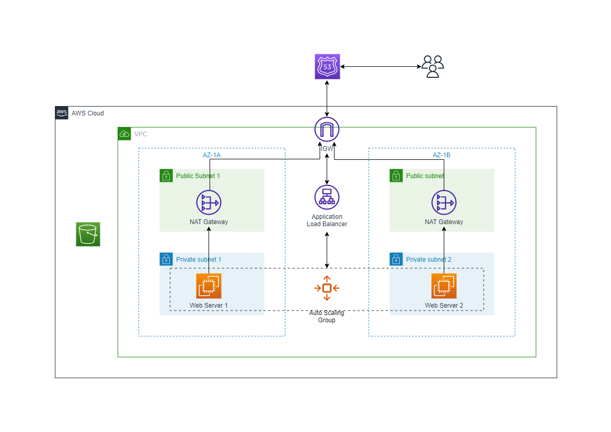

# Terraform Modules Project

This repository contains code used to create aws infrastructure following the architecture diagram below. 👇
 
 

## Modules To Created
These are a list of the modules that will be created in the `./modules` directory.

- VPC module
- NAT Gateway module
- Security Group module
- ASG (Auto Scaling Group) module
- ALB (Application Load Balancer) module
- Route53 module

## Remote State
Here, we are using an AWS **S3 Bucket** and **DynamoDB Table** to store the terraform state file remotely. The `./backend_state` directory contains the code necessary to create these resources.